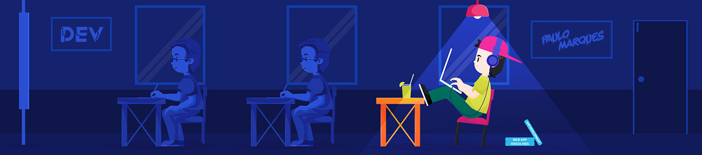

    <h1>Sou o Paulo. Prazer!</h1>
    

        
    

    

        <h3>
            Sou estudante de desenvolvimento mobile.
            Atualmente resido em Brasília - DF. Sou curioso, entusiasmado e um pouco pragmático.
            Amo aprender coisas novas e descobrir maneiras diferentes de lidar com um mesmo problema.
        </h3>
    
  
    

        <ul>
            <li>🔭 No momento, estou desempregado, estudando e aplicando para vagas na área de programação.  </li>
            <li>🌱 Atualmente estou estudando Java, Kotlin e Android</li>
            <li>⚡ Spoiler: Amo um bom desafio!</li>
        </ul>
    

 

  
    <h1>Habilidades</h1>
    
  
          
          
          
          
          
          
          
          
          
          
          
          
    
  

  

   

    <h1>Redes Sociais</h1>
    

        
        
        
        
          
    
  

  
  

   
   

    <h1>GitHub Estatísticas</h1>
    

        
        
    

   

    

  

   

  
